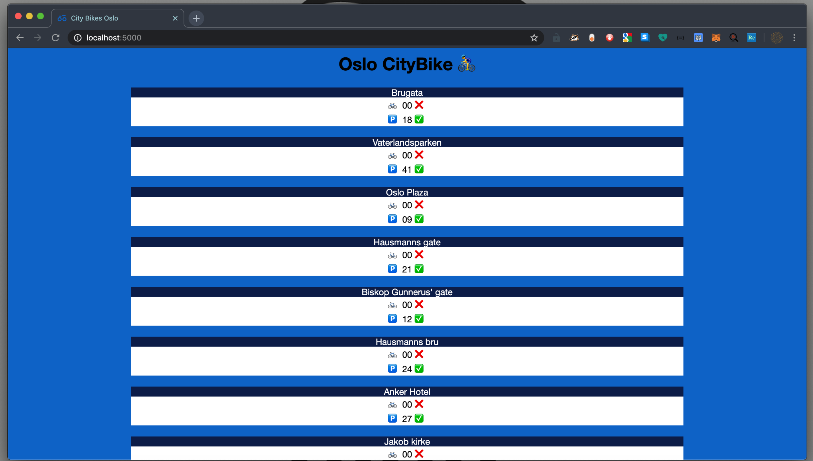

# CityBike
_A small script to get all city bike stations, their capacity and number of available bikes. Built with python and Flask using OsloBysykkel APIs_



## Usage

### Clone
````shell
git clone https://github.com/dizzi90/bysykkel
cd bysykkel
````

### Simple
````shell
$ pipenv shell
$ (bysykkel) python3 app/app.py
````

### Docker
````shell
$ docker build -f deploy/Dockerfile -t bysykkel:test .
$ docker run -p 3000:3000 bysykkel:test
````
